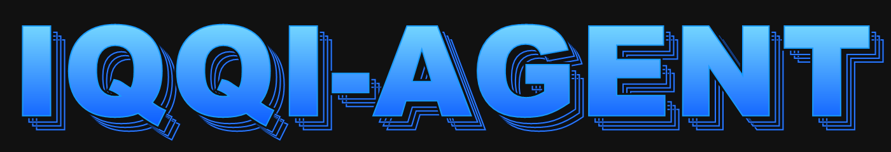

<p align="center">
  
</p>

# IQQI-AGENT

<p align="center">
  <strong>Our branded fork of Hermes Agent, prepared as the command-line and desktop agent layer for IQQI.</strong>
</p>

<p align="center">
  <a href="https://github.com/codeVladimir22/IQQI-agent"></a>
  <a href="LICENSE"></a>
  <a href="#phase-1-branding-scope"></a>
</p>

IQQI-AGENT is the first branding pass over the Hermes Agent fork. The goal of this phase is to make the product read as IQQI while preserving the proven Hermes runtime underneath: package names, Python modules, entrypoints, environment variables, installers, and dependency wiring stay intact until we intentionally plan a deeper migration.

That means the current executable commands are still Hermes-compatible during this phase:

```bash
hermes              # interactive CLI
hermes model        # choose provider and model
hermes tools        # configure enabled tools
hermes gateway      # start the messaging gateway
hermes setup        # setup wizard
hermes update       # update flow
hermes doctor       # diagnostics
```

## Phase 1 Branding Scope

This phase is intentionally dependency-safe.

Changed now:

- Public README language and banner.
- Desktop-facing product copy and visible app naming.
- Documentation site title, navbar, footer, and visual palette.
- In-app brand mark used in About and onboarding surfaces.
- Repository-facing metadata where it does not affect package resolution.

Left untouched for later:

- Python package name: `hermes-agent`.
- Python module/package paths: `hermes_cli`, `hermes_constants`, `agent`, `gateway`, etc.
- CLI entrypoints: `hermes`, `hermes-agent`, `hermes-acp`.
- Environment variables and profile paths: `HERMES_HOME`, `%LOCALAPPDATA%\hermes`, `~/.hermes`.
- Dependency groups and lockfiles.
- Installer internals that assume the Hermes runtime layout.

This lets us move the image and design toward IQQI-AGENT without breaking install, upgrade, packaging, or provider integrations.

## What IQQI-AGENT Inherits

IQQI-AGENT keeps the Hermes Agent feature set as the base:

| Capability | Included |
| --- | --- |
| Terminal interface | CLI/TUI conversation flow, slash commands, streaming tool output, history, interrupts. |
| Model flexibility | Works with OpenAI-compatible providers, OpenRouter, Anthropic, Gemini, local endpoints, and other configured backends. |
| Tools | Shell, file work, browser/search integrations, MCP, scheduled tasks, and provider-specific tool gateways. |
| Memory and skills | Persistent memory, skill creation, optional skills, bundled skills, and session search. |
| Messaging gateway | Telegram, Discord, Slack, WhatsApp, Signal, email, and other configured platforms. |
| Desktop shell | Electron desktop app with chat, previews, settings, model controls, files, and terminal panels. |

## Install Notes

Until the deeper runtime rename is complete, use the existing Hermes install paths and commands. This is deliberate.

```bash
curl -fsSL https://hermes-agent.nousresearch.com/install.sh | bash
```

Windows PowerShell:

```powershell
iex (irm https://hermes-agent.nousresearch.com/install.ps1)
```

After install:

```bash
hermes
```

For local development:

```bash
git clone https://github.com/codeVladimir22/IQQI-agent.git
cd IQQI-agent
./setup-hermes.sh
./hermes
```

## Migration Plan

1. Initial IQQI branding: replace visible Hermes/Nous presentation while preserving runtime compatibility.
2. Design pass: refine desktop/docs palette, marks, screenshots, and copy into a coherent IQQI-AGENT identity.
3. Runtime rename analysis: map every `hermes` identifier to determine which are safe aliases, which require migrations, and which should remain compatibility shims.
4. Installer and package rename: only after dependency, update, ACP, desktop, docs, and profile migration paths are tested.

## Development

The project remains a Python + Node monorepo:

- Core agent/runtime: Python modules at the repo root plus `agent/`, `tools/`, `gateway/`, `hermes_cli/`.
- Desktop app: `apps/desktop`.
- Bootstrap installer: `apps/bootstrap-installer`.
- Web/dashboard/docs surfaces: `web/` and `website/`.
- TUI package: `ui-tui`.

Run targeted checks for the area you change. Avoid renaming runtime files until the deeper migration phase has a compatibility plan.

## License

MIT. See [LICENSE](LICENSE).
